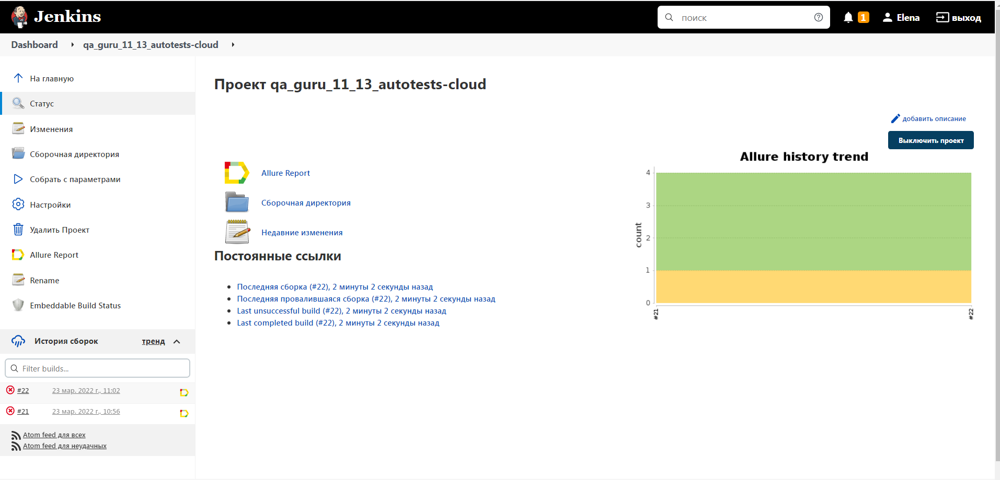
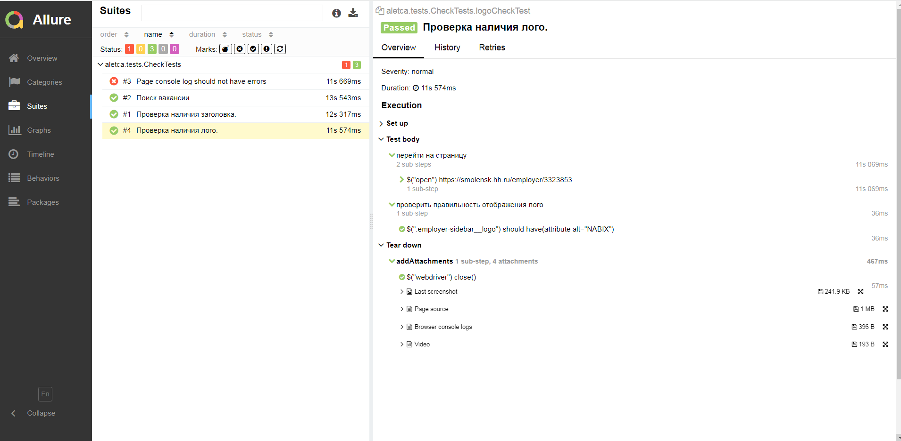
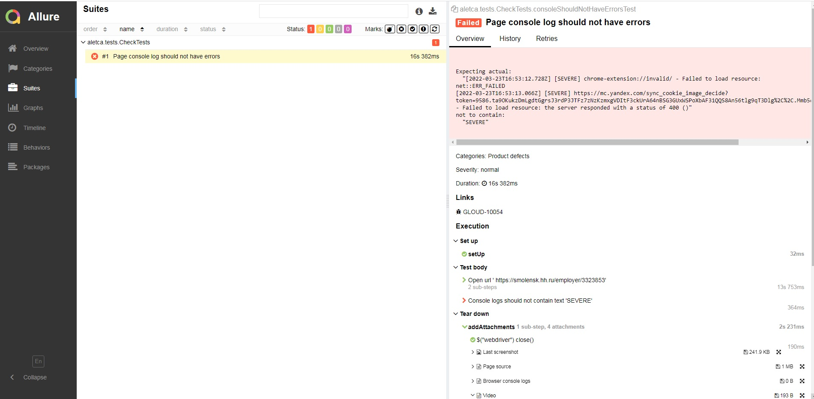
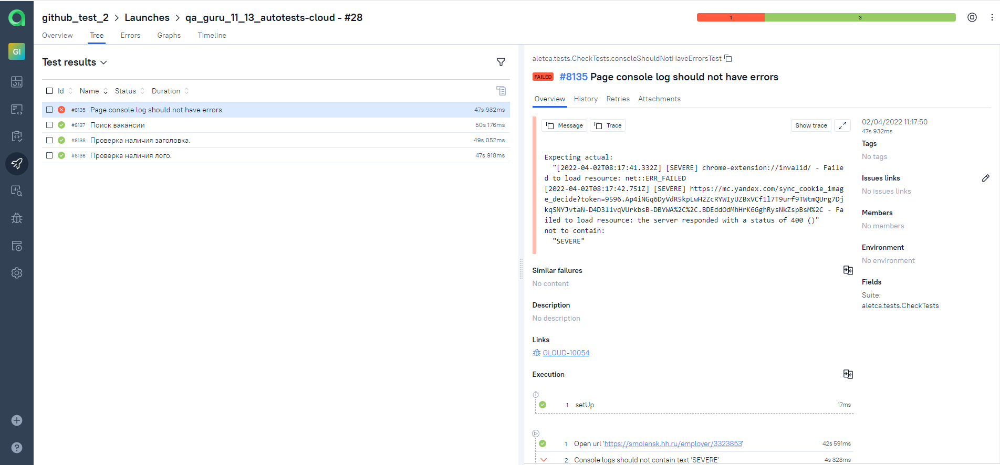
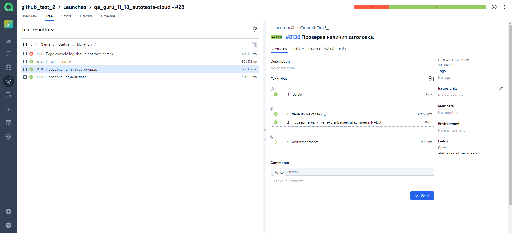
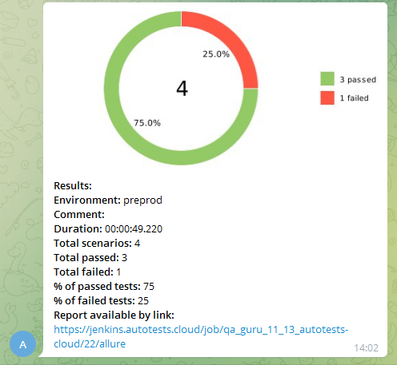

# Проект по автоматизации тестирования сайта NABIX

## Содержание:       :pushpin:

> :large_blue_diamond: Запуск тестов
>
> :large_blue_diamond: Jenkins
>
> :large_blue_diamond: Allure
>
> :large_blue_diamond: Allure TestOps
>
> :large_blue_diamond: Интеграция с Jira
>
> :large_blue_diamond: Уведомления в Telegram
>
> :large_blue_diamond: Selenoid

***

## Технологии и инструменты       :pushpin:

<code></code>
<code></code>
<code></code>
<code></code>
<code></code>
<code></code>
<code></code>
<code></code>
<code></code>
<code></code>
<code></code>

> <code>IntelliJ IDEA</code> — интегрированная среда разработки программного обеспечения для многих языков программирования,
> в частности Java, JavaScript, Python, разработанная компанией JetBrains.
>
> Программы на <code>Java</code> транслируются в байт-код, который затем выполняется виртуальной машиной Java (JVM).
> JVM — это программа, которая обрабатывает байтовый код и передает инструкции оборудованию как интерпретатор.
> Достоинством подобной реализации является независимость байт-кода от операционной системы и оборудования,
> что позволяет выполнять Java-приложения на любом устройстве, для которого существует JVM.
>
> <code>Selenide</code> - это автоматизированная среда тестирования, управляемая Selenium WebDriver, которая имеет следующие преимущества:
> - Оптимизированный API
> - Поддержка теста стабильности Ajax
> - Мощный реальный селектор объекта страницы
>
> <code>Gradle</code> — система автоматической сборки, построенная на принципах Apache Ant и Apache Maven, но предоставляющая DSL на языках Groovy и Kotlin
> вместо традиционной XML-образной формы представления конфигурации проекта.
>
> <code>JUnit</code> — библиотека для модульного тестирования программного обеспечения на языке Java.
>
> <code>Allure</code> — фреймворк от Яндекса для создания простых и понятных отчётов автотестов
>
> <code>Jenkins</code> — программная система с открытым исходным кодом на Java,
> предназначенная для обеспечения процесса непрерывной интеграции программного обеспечения.
>
> <code>Selenoid</code> — это сервер, который позволяет запускать браузеры в docker контейнерах.

***

##  Реализованные проверки       :pushpin:
> :heavy_check_mark: Проверка наличия лого              
> :heavy_check_mark: Проверка наличие текста 'Вакансии компании NABIX'          
> :heavy_check_mark: Поиск вакансии*          
> :ballot_box_with_check: Проверка отсутствия ошибок в консоли :lady_beetle:

***

## Локальный запуск тестов       :pushpin:
~~~
gradle clean smoke_tests
gradle clean test -Dbrowser=mozilla -Dversion=80 -DbrowserSize=600x600
~~~
***

## Удаленный запуск тестов       :pushpin:
~~~
clean
test
-Dbrowser=${BROWSER}
-DbrowserVersion=${BROWSER_VERSION}
-DbrowserSize=${BROWSER_SIZE}
-DbrowserMobileView="${BROWSER_MOBILE}"
-DremoteDriverUrl=https://${LOGIN}:${PASSWORD}@${REMOTE_DRIVER_URL}/wd/hub/
-DvideoStorage=https://${REMOTE_DRIVER_URL}/video/
-Dthreads=${THREADS}}
~~~
***

## Запуск тестов в [Jenkins](https://jenkins.autotests.cloud/job/qa_guru_11_13_autotests-cloud/)       :pushpin:

  

***

## Отчет о результатах тестирования из Jenkins в [Allure Report](https://jenkins.autotests.cloud/job/qa_guru_11_13_autotests-cloud/19/allure/)       :pushpin:

 

***

## Отчет о результатах тестирования в Allure со ссылкой на баг-репорт в Jira       :pushpin:

  

***

## Интеграция с Allure TestOps       :pushpin:

___

***
## Уведомления в Telegram с использованием бота       :pushpin:
_После завершения сборки специальный бот, созданный в Telegram, автоматически обрабатывает и отправляет сообщение с отчетом о прогоне тестов._

 

***
## Пример запуска теста в Selenoid       :pushpin:

***

[Вверх](#anchor)
